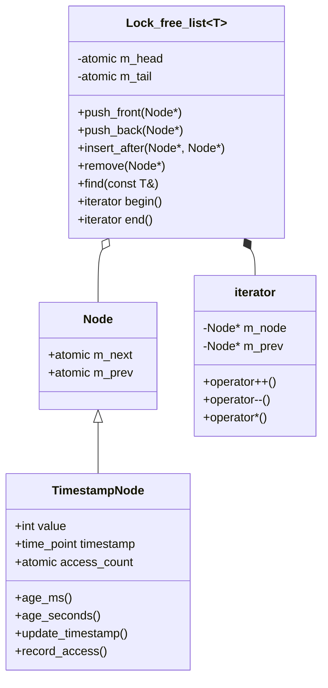
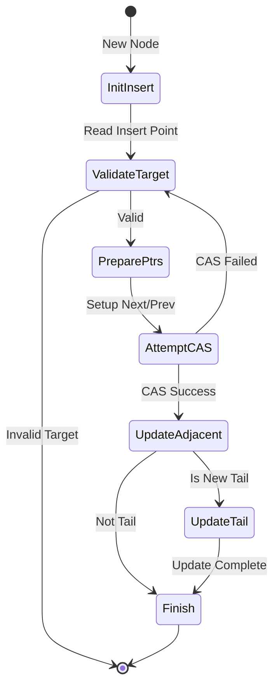
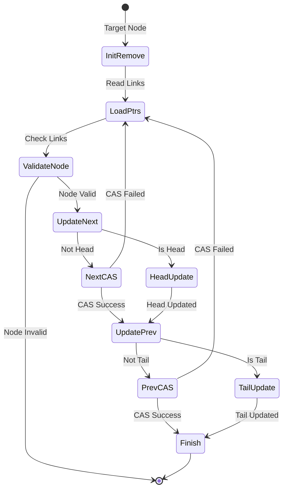
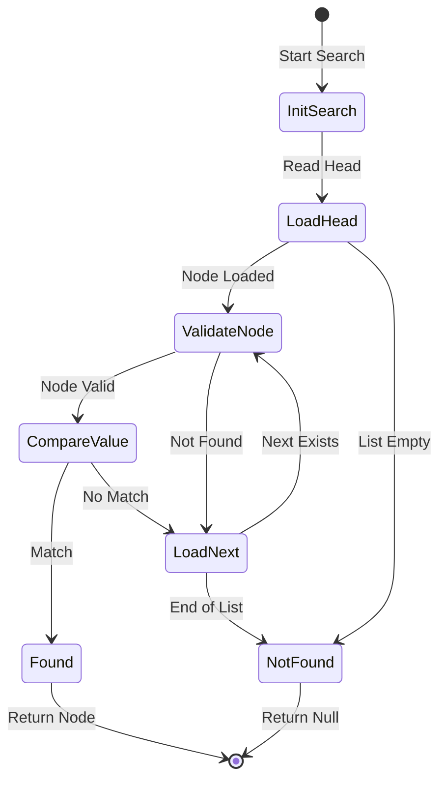
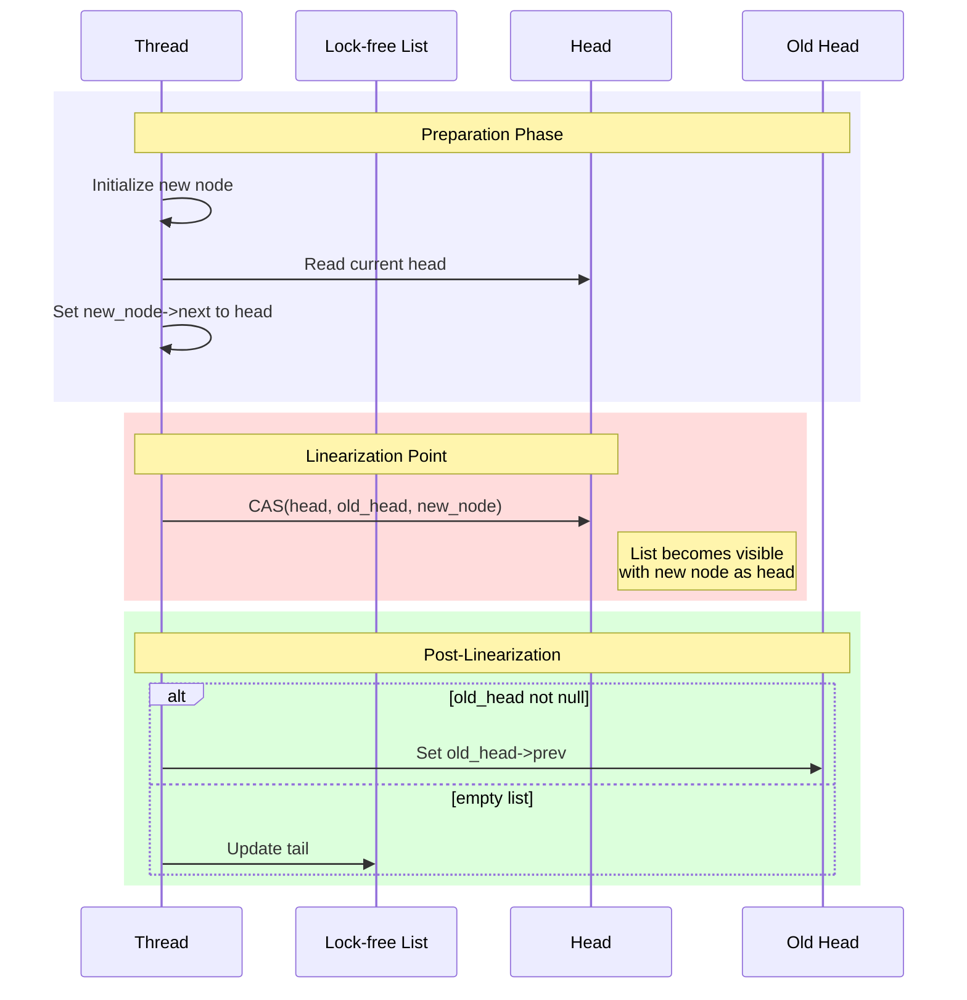
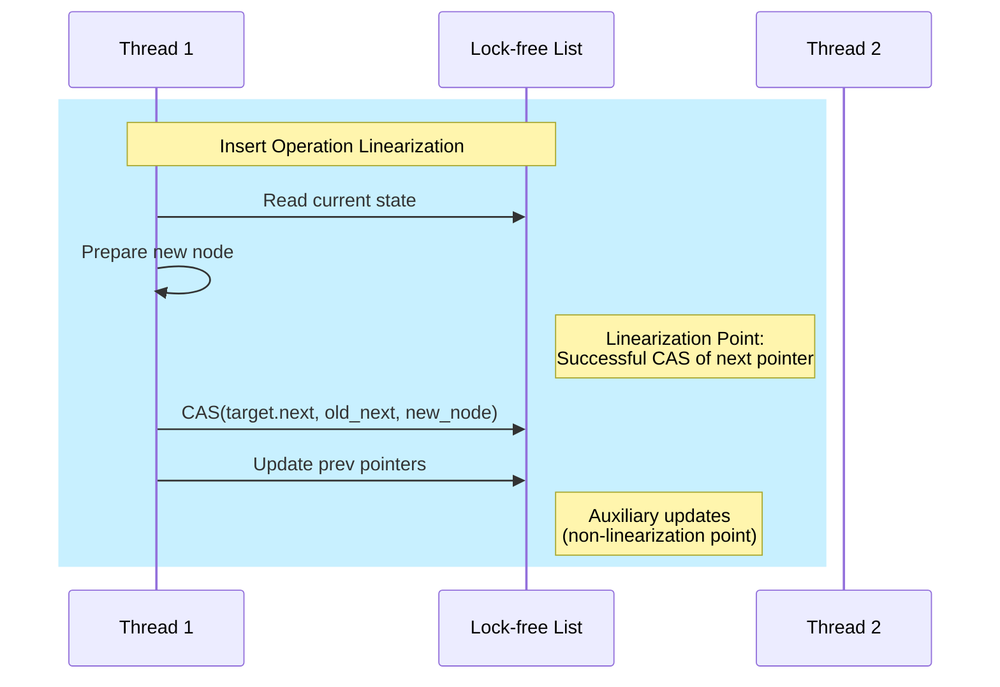
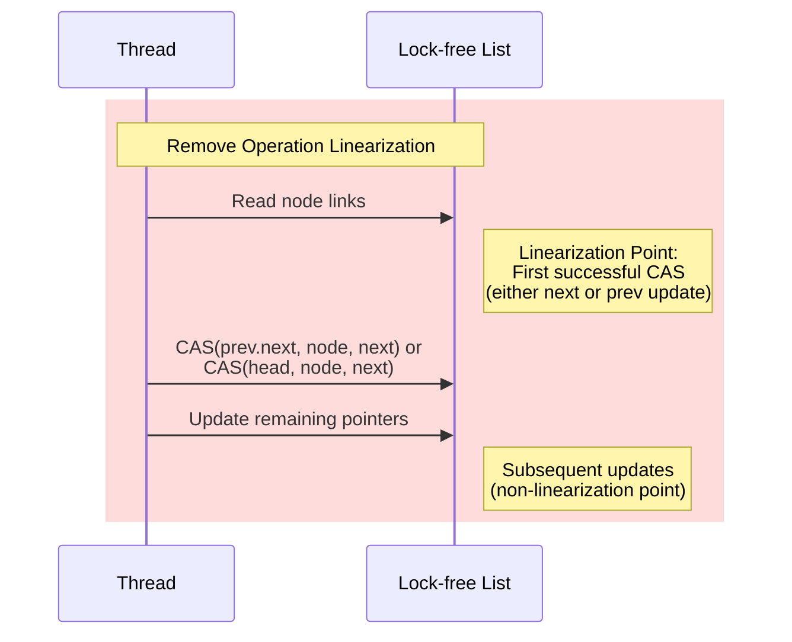

# Lock-Free Doubly Linked List Design

This document details the architecture, states, and linearization points of our lock-free doubly linked list implementation.

## Architecture

### Core Components



## State Diagrams

### Insert Operation States



### Remove Operation States



### Search Operation States



## Linearization Points

### Push Front Operation



### Insert After Operation



### Remove Operation



## Operation Details

### Push Front
```cpp
void push_front(Node* node) {
    assert(node != nullptr);
    
    // Initialize node
    node->m_next.store(nullptr, std::memory_order_relaxed);
    node->m_prev.store(nullptr, std::memory_order_relaxed);

    for (;;) {
        auto old_head = m_head.load(std::memory_order_acquire);
        node->m_next.store(old_head, std::memory_order_relaxed);
        
        // LINEARIZATION POINT
        if (m_head.compare_exchange_weak(old_head, node, 
                                       std::memory_order_release,
                                       std::memory_order_relaxed)) {
            if (old_head != nullptr) {
                old_head->m_prev.store(node, std::memory_order_release);
            } else {
                m_tail.store(node, std::memory_order_release);
            }
            return;
        }
    }
}
```

### Insert After
```cpp
bool insert_after(Node* target, Node* new_node) {
    assert(target != nullptr && new_node != nullptr);
    
    new_node->m_next.store(nullptr, std::memory_order_relaxed);
    new_node->m_prev.store(nullptr, std::memory_order_relaxed);
    
    for (;;) {
        auto next = target->m_next.load(std::memory_order_acquire);
        new_node->m_next.store(next, std::memory_order_relaxed);
        new_node->m_prev.store(target, std::memory_order_relaxed);
        
        // LINEARIZATION POINT
        if (target->m_next.compare_exchange_weak(next, new_node,
                                               std::memory_order_release,
                                               std::memory_order_relaxed)) {
            if (next != nullptr) {
                next->m_prev.store(new_node, std::memory_order_release);
            }
            return true;
        }
    }
}
```

### Remove
```cpp
void remove(Node* node) {
    assert(node != nullptr);
    
    for (;;) {
        auto prev = node->m_prev.load(std::memory_order_acquire);
        auto next = node->m_next.load(std::memory_order_acquire);
        
        if (prev != nullptr) {
            // LINEARIZATION POINT for non-head nodes
            if (prev->m_next.compare_exchange_strong(node, next,
                                                   std::memory_order_release)) {
                if (next != nullptr) {
                    next->m_prev.store(prev, std::memory_order_release);
                }
                return;
            }
        } else {
            // LINEARIZATION POINT for head node
            if (m_head.compare_exchange_strong(node, next,
                                             std::memory_order_release)) {
                if (next != nullptr) {
                    next->m_prev.store(nullptr, std::memory_order_release);
                }
                return;
            }
        }
    }
}
```

## Memory Ordering Requirements

| Operation | Load Order | Store Order | CAS Order |
|-----------|------------|-------------|-----------|
| push_front| acquire    | relaxed     | release   |
| insert_after| acquire   | relaxed     | release   |
| remove    | acquire    | release     | release   |
| find      | acquire    | N/A         | N/A       |

## Safety Properties

1. **No Lost Nodes**: All nodes are reachable from either the list or marked as removed
2. **No ABA Problems**: Handled through proper memory ordering and atomics
3. **Memory Safety**: All operations maintain list integrity under concurrent access
4. **Progress Guarantee**: Lock-free for all operations

## Progress Guarantees

1. **Lock-Freedom**: All operations are lock-free
2. **Wait-Freedom**: Traversal operations are wait-free
3. **Obstruction-Freedom**: Modifications succeed if run in isolation
